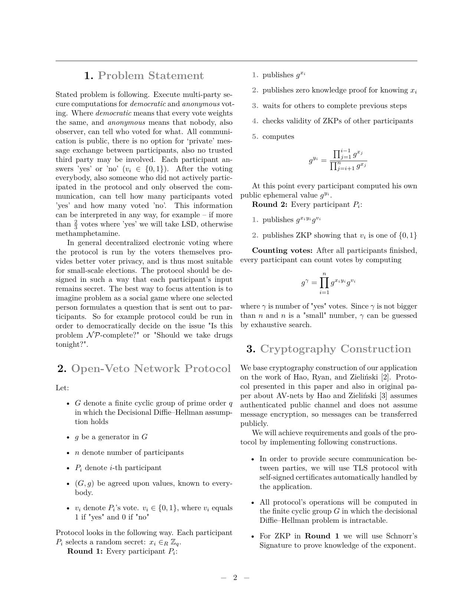
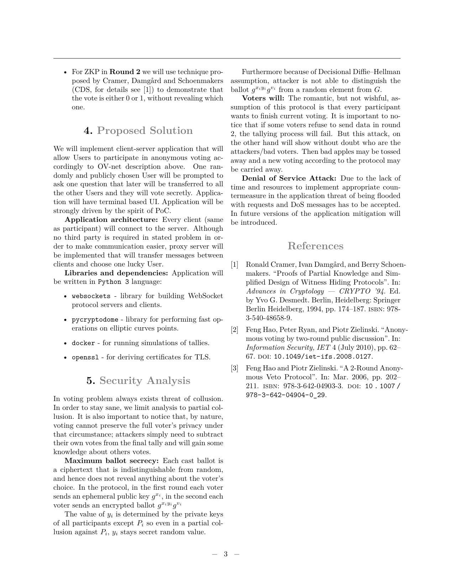

# dining_cryptocoryne - Securocracy

Open Veto network (OV-net) implementation.

Original paper (very good):
[_"A 2-Round Anonymous Veto Protocol"_](https://link.springer.com/chapter/10.1007/978-3-642-04904-0_28#citeas)
by Hao, F., Zieliński, P. (2009).

### Protocol overview with some extra assumptions:

<p align="center">
  
  
  
</p>

Also a melancholy, get-back-together story.

### Technologies:

```
Python 3.8
Docker 20.10.16
docker-compose 1.29.2
Pipenv 2021.5.29
```

### Dependencies (see Pipfile):

```bash
websockets>=10.2
pycryptodomex>=3.14
```

### To run:

```bash
# in the main directory
pipenv install
pipenv shell
(...) bash run_securocracy.sh
```

### Certificates generation:

```bash
openssl req -x509 -newkey rsa:4096 -keyout securocracy_key.pem -out securocracy_cert.pem -sha256 -days 365 -nodes -subj '/CN=localhost'
```
